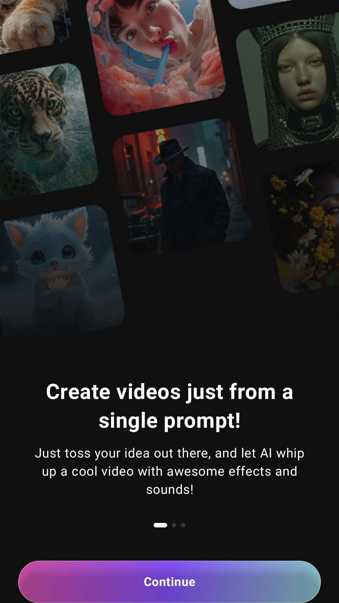

# Project Title

Simple Android project.

## Features

- AI video generation
- Text to video support
- Image to video support

## Installation
- Clone the repository.
- Open in Android Studio.
- Build the project.

## Requirements
- Android 9.0+
- Internet connection required.

## Future updates
- Improve UI.
- Add more AI models.
- Optimize performance.
- Bug fixes.
- Refactor code structure.
- Improve documentation.
- Minor improvements.

## Screenshots

# Documentation
